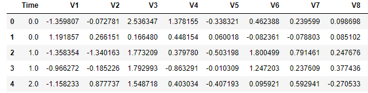
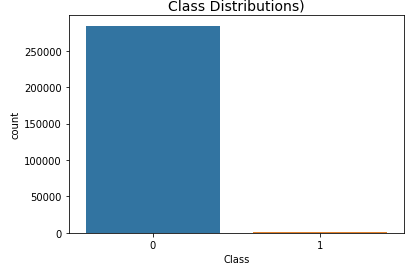

# Credit card fraud detection - imbalanced classification
* Created models to detect credit card fraud by developing 2 approaches that addresses the issues of imbalanced data classification
* Rebalanced the dataset by undersampling the majority class, oversampling the minority class or synthesizing new data
* Tested and evaluated multiple classification algorithms combined with distinct under/over-sampling techniques
* Attacked the imbalance issue by implementing threshold-moving technique, and tested different classification algorithms

## Code and Resources Used
**Python Version:** 3.8

**Packages:** imblearn, sklearn, pandas, numpy, matplotlib, seaborn

## Data Overview
The dataset contains transactions made by credit cards that occurred in two days, where we have 492 frauds out of 284,807 transactions, which makes the dataset highly unbalanced - the positive class (frauds) account for only 0.172% of all transactions. It contains 28 numerical input variables which are the result of a PCA transformation, and 2 original data: time elapsed and amount. The purpose of this project is to identify fraudulent credit card transactions

## EDA

## Data Preprocessing & Featue Engineering
All the 28 V features have already been scaled, and "time" and "amount" shoul be scaled as the other columns. Therefore, I applied standardization on those 2 variables

### Notable Pitfalls
* Since the dataset is highly imbalanced and the positive class only accounts for 0.172%, using conventional train_test_split method from sklearn may cause seriosu issues such that fraud class is underrepresented. Therefore, a method that addresses this issue should be used. In this case, I used StratifiedShuffleSplit from sklearn, which ensures that relative class frequencies is approximately preserved in each train and validation fold
* For the first attempts, I fell into the second pitall I want to mention here: I under/over-sampled data before cross validation, which casued "data leakage" problem, so that the precision and recall scores on the initial attempts were surreally  good due to overfitting. However, in this case, one should neither cross validate before nor after resampling. Finally I realized to cross validate while resampling, while putting everything in a pipeline
