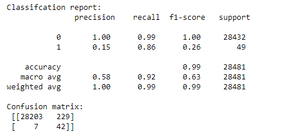
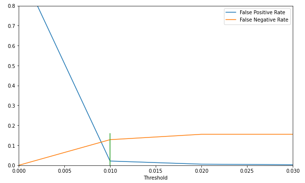

# Credit card fraud detection - imbalanced classification
* Created models to detect credit card fraud by developing 2 approaches that addresses the issues of imbalanced data classification
* Rebalanced the dataset by undersampling the majority class, oversampling the minority class or synthesizing new data
* Tested and evaluated multiple classification algorithms combined with distinct under/over-sampling techniques
* Attacked the imbalance issue by implementing threshold-moving technique, and tested different classification algorithms

## Code and Resources Used
**Python Version:** 3.8

**Packages:** imblearn, sklearn, pandas, numpy, matplotlib, seaborn

## Data Overview
The dataset contains transactions made by credit cards that occurred in two days, where we have 492 frauds out of 284,807 transactions, which makes the dataset highly unbalanced - the positive class (frauds) account for only 0.172% of all transactions. It contains 28 numerical input variables which are the result of a PCA transformation, and 2 original data: time elapsed and amount. The purpose of this project is to identify fraudulent credit card transactions

## EDA
Correlation: it looks like the correlations among features are pretty distinct between fraud and non-fraud classes

## Data Preprocessing & Featue Engineering
All the 28 V features have already been scaled, and "time" and "amount" shoul be scaled as the other columns. Therefore, I applied standardization on those 2 variables

### Notable Pitfalls
* Since the dataset is highly imbalanced and the positive class only accounts for 0.172%, using conventional train_test_split method from sklearn may cause seriosu issues such that fraud class is underrepresented. Therefore, a method that addresses this issue should be used. In this case, I used StratifiedShuffleSplit from sklearn, which ensures that relative class frequencies is approximately preserved in each train and validation fold
* For the first attempts, I fell into the second pitall I want to mention here: I under/over-sampled data before cross validation, which casued "data leakage" problem, so that the precision and recall scores on the initial attempts were surreally  good due to overfitting. However, in this case, one should neither cross validate before nor after resampling. Finally I realized to cross validate while resampling, while putting everything in a pipeline

## Model Building
### Approach 1: Rebalancing through resampling
To avoid the pitfalls that I mentioned above, I used the StratifiedShuffleSplit method from sklearn to split the training and test sets in order to preserve the distribution of the two classe in training and validation sets, and I combined the resampling and cross validating in one step through the use of a pipeline from the imblearn package

Evaluation metrics such as accuracy is nearly meaningless in imbalanced classification, since even the model couldn't identify one fraud, the value would still be very high due to its sensitvity to the dominant class. And either precision or recall only tells one side of the story. Therefore, I decided to mainly look at the F-1 score as the evaluation metric because it's the harmonic mean of the precision and recall, and tells a better story from the two sides

I tested and evaluated several combinations of resampling methods and classifiers

The resampling methods that I tried:

Undersampling
* Random Undersampling
* NearMiss-2
Oversampling
* Random Oversampling
* SMOTE
* Borderline SMOTE
* ADASYN

The classifiers that I used:
* Logistic Regression
* Random Forest Classifier

#### Model Performance
Borderline SMOTE + Logistic Regression did the best job, and achieved the highest F-1 score (0.26), however, from the first glance, it does not look that good - the model sacrifices precision for recall

### Approach 2: Threshold moving
It is not absolutely necessary to rebalance the data through resampling to attack the issue, if we are not to limit ourselves to using the default implicit classification decision threshold of 0.5. We can achieve the goal of improving recall (reducing fraud losses - reducing false negatives) through raising the number of false positives that we can accept. To do this, we can reduce the threshold

I tried 3 classifiers with the threshold moving strategy
* Logistic Regression

* Random Forest Classifier

* Histogram-based Gradient Boosting classification tree

